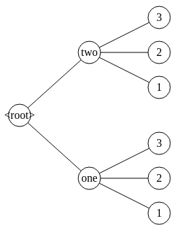
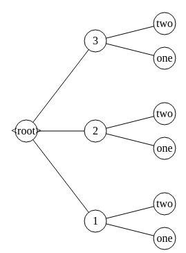

## Example

If we represent the following table 

|col1|col2|
|---|---|
|one|1|
|one|2|
|one|3|
|two|1|
|two|2|
|two|3|

as a tree (by merging the cells with the same values in that column) we get the following tree with 9 nodes:

When you switch the columns you get the following tree with 8 nodes.

Note that using different order of columns can influence the number of nodes the resulting tree has (even though both trees represent the same information).